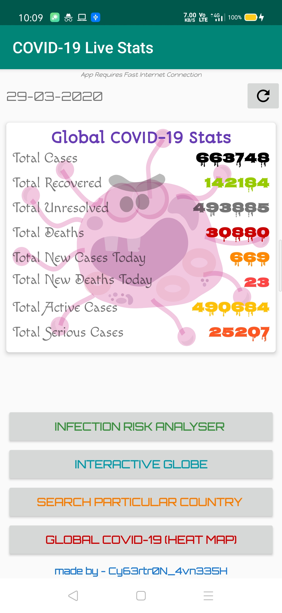

# COVID-19-App
Download App from [here](https://github.com/Cybertron-Avneesh/COVID-19-App/raw/master/Covid-19.apk).
### Details
 - This Android App aims to provide user a latest Covid-19 Stats using API.
### Description
 - This App fetches latest data from thevirustracker-API and shows them.
 - User can Search for a Particular Country.
 - Total number of countries available is 182.
 - Bing's covid tracking webpage and CovidVisualixer.com's webpage has also been implemented as webview in the app.
 - In case Thevirustracker API sems to be broken user can still track Covid-19 Stats.
### Screenshots
> Home Screen

### Credits
 - Used [Bing.com/covid](https://bing.com/covid)
 - Used [Covidvisualizer.com](https://covidvisualizer.com)
 - API used to fetch latest data is [Thevirustracker](https://thevirustracker.com)
 - Use Google Forms to implement Quick Covid Infection Analyser.
### Dependencies
`  implementation 'com.android.volley:volley:1.1.0'  `
